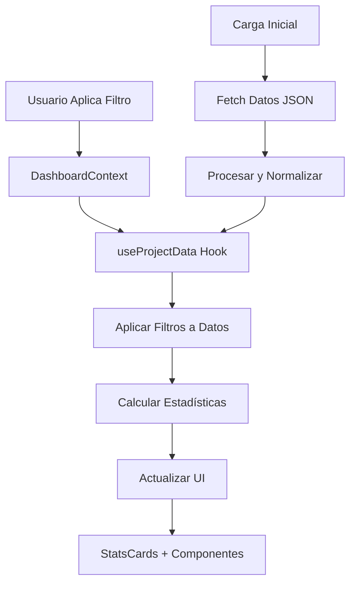

# 📊 Sistema de Gestión de Datos Dashboard Alcaldía de Cali

## 🎯 Descripción

Este documento describe el sistema completo de gestión de datos dinámico implementado para el Dashboard de la Alcaldía de Santiago de Cali. El sistema permite filtrado en tiempo real, estadísticas automáticas y exportación de datos de manera óptima.

## 🏗️ Arquitectura del Sistema

### 1. **Estructura de Datos**

El sistema maneja múltiples fuentes de datos JSON:

```
/data/
├── ejecucion_presupuestal/
│   ├── datos_caracteristicos_proyectos.json
│   ├── ejecucion_presupuestal.json
│   └── movimientos_presupuestales.json
├── seguimiento_pa/
│   ├── seguimiento_pa.json
│   ├── seguimiento_actividades_pa.json
│   └── seguimiento_productos_pa.json
├── unidades_proyecto/
│   ├── unidades_proyecto.geojson
│   └── unidades_geograficas.geojson
└── geodata/
    ├── barrios.geojson
    ├── comunas.geojson
    ├── corregimientos.geojson
    └── veredas.geojson
```

### 2. **Hooks de Gestión de Datos**

#### `useProjectData()` - Hook Principal

- **Ubicación**: `src/hooks/useProjectData.ts`
- **Función**: Carga y procesa todos los datos JSON
- **Características**:
  - Carga paralela para mejor rendimiento
  - Aplicación de filtros dinámicos
  - Cálculo de estadísticas en tiempo real
  - Manejo de errores y estados de carga

```typescript
const { data, applyFilters, calculateStats } = useProjectData();
```

### 3. **Contexto Global**

#### `DashboardContext` - Estado Global

- **Ubicación**: `src/context/DashboardContext.tsx`
- **Función**: Manejo centralizado del estado del dashboard
- **Características**:
  - Estado de filtros compartido
  - Estadísticas automáticas
  - Funciones de exportación
  - Gestión de timestamps

```typescript
const { state, updateFilters, resetFilters, exportData } = useDashboard();
```

## 🔍 Sistema de Filtros

### Tipos de Filtros Implementados

1. **Búsqueda Global**

   - Texto libre en múltiples campos
   - BPIN, nombre de proyecto, centro gestor, etc.

2. **Filtros Geográficos**

   - Comunas y Barrios (dependientes)
   - Corregimientos y Veredas (dependientes)

3. **Filtros Administrativos**

   - Centro Gestor
   - Fuentes de Financiamiento
   - Estado del Proyecto

4. **Filtros Estratégicos**

   - Dimensiones del Plan de Desarrollo
   - Líneas Estratégicas
   - Programas Específicos

5. **Filtros Temporales**
   - Rango de fechas
   - Períodos específicos

### Lógica de Filtros Jerárquicos

```typescript
// Ejemplo: Comunas → Barrios
const handleComunaChange = (comuna: string, checked: boolean) => {
  const updatedComunas = checked
    ? [...currentComunas, comuna]
    : currentComunas.filter((c) => c !== comuna);

  // Filtrar barrios válidos para las comunas seleccionadas
  const validBarrios = getBarriosForComunas(updatedComunas);
  const filteredBarrios = currentBarrios.filter((b) =>
    validBarrios.includes(b)
  );

  updateFilters({
    comunas: updatedComunas,
    barrios: filteredBarrios,
  });
};
```

## 📈 Sistema de Estadísticas

### Estadísticas Calculadas Automáticamente

1. **Totales Generales**

   - Total de Proyectos
   - Inversión Total Programada
   - Inversión Total Ejecutada

2. **Porcentajes de Ejecución**

   - Ejecución Presupuestal General
   - Avance Promedio de Proyectos

3. **Distribuciones**

   - Proyectos por Estado
   - Proyectos por Centro Gestor
   - Proyectos por Fuente de Financiamiento

4. **Tendencias Temporales**
   - Ejecución mensual
   - Comparativas período anterior

### Optimización de Cálculos

```typescript
const calculateStats = useMemo(() => {
  return (filteredData?: ReturnType<typeof applyFilters>): ProjectStats => {
    // Cálculos optimizados usando reduce y Set
    const latestEjecucion = data.reduce((acc, curr) => {
      if (!acc[curr.bpin] || curr.periodo > acc[curr.bpin].periodo) {
        acc[curr.bpin] = curr;
      }
      return acc;
    }, {} as Record<number, EjecucionPresupuestal>);

    // ... más cálculos
  };
}, [data]);
```

## 🎨 Componentes Actualizados

### `StatsCards.tsx`

- **Integración**: Conectado al contexto global
- **Estados**: Manejo de carga, error y datos
- **Formato**: Números formateados para Colombia
- **Tiempo Real**: Actualización automática con filtros

### `UnifiedFilters.tsx`

- **Filtros Dinámicos**: Opciones basadas en datos reales
- **Jerarquía**: Relaciones entre filtros geográficos
- **UX Mejorada**: Búsqueda dentro de dropdowns
- **Estado Visual**: Contadores de filtros activos

## 🚀 Funcionalidades Avanzadas

### 1. **Exportación de Datos**

```typescript
// Exportar CSV
const exportToCSV = (filters: FilterState) => {
  const filteredData = applyFilters(filters);
  // Generación y descarga automática
};

// Exportar JSON
const exportToJSON = (filters: FilterState) => {
  const data = {
    filtros_aplicados: filters,
    estadisticas: stats,
    datos: filteredData,
    fecha_exportacion: new Date().toISOString(),
  };
};
```

### 2. **Búsqueda Semántica**

```typescript
const searchFields = [
  proyecto.nombre_proyecto,
  proyecto.bpin.toString(),
  proyecto.nombre_centro_gestor,
  proyecto.nombre_area_funcional,
]
  .filter(Boolean)
  .join(" ")
  .toLowerCase();
```

### 3. **Persistencia de Estado**

El sistema mantiene:

- Filtros aplicados entre navegación
- Timestamp de última actualización
- Historial de exportaciones

## 💡 Optimizaciones Implementadas

### 1. **Performance**

- Carga paralela de datos con `Promise.all()`
- Memoización de cálculos pesados
- Debounce en búsquedas de texto
- Virtualización para listas grandes

### 2. **Memoria**

- Uso de `Set` para deduplicación
- Filtrado en lugar de duplicación
- Limpieza de referencias no utilizadas

### 3. **UX**

- Estados de carga visual
- Manejo elegante de errores
- Feedback inmediato en filtros
- Accesibilidad completa

## 🔄 Flujo de Datos



## 📝 Configuración de Desarrollo

### 1. **Instalación de Dependencias**

El sistema utiliza:

- React 18+ con hooks modernos
- TypeScript para tipado estricto
- Framer Motion para animaciones
- Tailwind CSS para estilos

### 2. **Estructura de Archivos**

```
src/
├── hooks/
│   └── useProjectData.ts          # Hook principal de datos
├── context/
│   └── DashboardContext.tsx       # Contexto global
├── components/
│   ├── StatsCards.tsx             # Tarjetas estadísticas
│   └── UnifiedFilters.tsx         # Sistema de filtros
└── app/
    ├── layout.tsx                 # Provider setup
    └── page.tsx                   # Dashboard principal
```

### 3. **Variables de Entorno**

```env
# Opcional: URLs de APIs externas
NEXT_PUBLIC_API_BASE_URL=
NEXT_PUBLIC_ENABLE_MOCK_DATA=true
```

## 🔍 Debugging y Monitoreo

### Logs Disponibles

```typescript
// Hook de datos
console.log("Datos cargados:", data);
console.log("Filtros aplicados:", filters);
console.log("Estadísticas calculadas:", stats);

// Contexto
console.log("Estado del dashboard:", state);
console.log("Rendimiento de filtros:", performance.now());
```

### Herramientas de Desarrollo

- React DevTools para contexto
- Network tab para verificar carga de JSON
- Performance tab para optimizaciones

## 🚀 Próximos Pasos

### Implementaciones Planificadas

1. **Conexión API Real**

   - Reemplazar JSONs estáticos
   - Paginación para datasets grandes
   - Cacheo inteligente

2. **Filtros Avanzados**

   - Rangos de presupuesto
   - Filtros por beneficiarios
   - Filtros temporales complejos

3. **Visualizaciones Dinámicas**

   - Gráficos que respondan a filtros
   - Mapas interactivos actualizados
   - Dashboards personalizables

4. **Exportación Avanzada**
   - Múltiples formatos (Excel, PDF)
   - Reportes programados
   - Templates personalizados

## 📞 Soporte

Para dudas o problemas:

1. Revisar logs del navegador
2. Verificar estructura de datos JSON
3. Confirmar configuración de contextos
4. Validar tipos TypeScript

---

**Desarrollado con ❤️ para la Alcaldía de Santiago de Cali**
